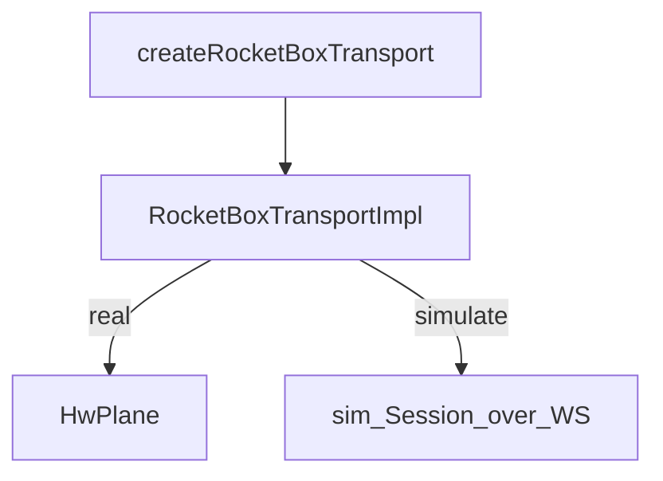

# TypeScript SDK (`sdks/typescript`) — `@rocketbox/sdk`

Single browser/native-TS SDK for RocketBox WebUSB and wire protocol. The PWA consumes this package; it does not implement USB itself.

## Vocabulary

Same as root [AGENTS.md](../../AGENTS.md): **RocketBox**, **port**, **session**, **transfer**, plus EP4 **switch**.

## Contract

1. **transfer** — ROCKETBX on data OUT `0x02` / IN `0x81` (announce, session, payload)
2. **switch** — EP4; announce leaves last dest (no idle dest=0 clear); hold if already switched; inbound announce aims at peer (`circuit_listen`); `ensureCircuit` for session send; leave dest after transfer (`transfer_leave`); `clearCircuit` only on user link release / decline

**App entry:** `createRocketBoxTransport({ simulate, port })` → `RocketBoxTransport`.

| Mode | Backend |
|------|---------|
| real | `HwPlane` — WebUSB, ROCKETBX, EP4 switch |
| `simulate=true` | `SimTransport` over WS |

Prefer `createRocketBoxTransport`. ATTACH is not the real HW contract.

## Newcomer flow



## Module map

```
create_transport.ts          createRocketBoxTransport()
  └─ rocketbox_transport.ts  RocketBoxTransportImpl (HW | sim)
       ├─ transports/hw_plane.ts     real USB orchestration
       │    ├─ usb_open / usb_pairing / usb_switch
       │    ├─ data_listen / data_send / data_recv
       │    └─ bulk_io
       └─ rocketbox_transport_sim.ts + session_core (simulate only)

api.ts / index.ts            public app surface + codecs
port.ts                      display port 1–4 ↔ internal index 0–3
protocol.ts / session_codec  ROCKETBX header + session messages
errors.ts                    RocketBoxError + code
transports/                  WebUSB I/O only (gate-enforced)
```

```
src/              # public API, codecs, RocketBoxTransportImpl
src/transports/   # WebUSB I/O + SimTransport only
```

WebUSB (`navigator.usb`, `transferIn` / `transferOut`, `claimInterface`) belongs only under `src/transports/`. No `src/fabric/` tree.

## Rules

- No UI / React / Vite imports
- Every source file ≤200 lines
- Gate: `scripts/check-single-ts-usb.sh`

## Tests

```bash
cd sdks/typescript && npm test
```

Consumer README: [README.md](./README.md).
