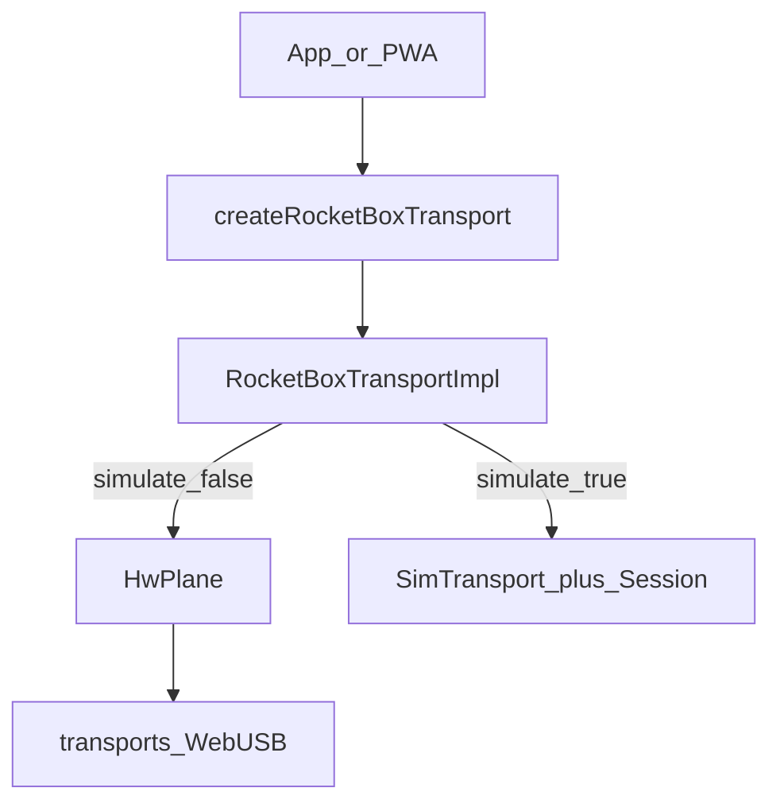

# `@rocketbox/sdk`

Browser TypeScript SDK for RocketBox WebUSB, ROCKETBX transfer, and session codecs. The PWA (`apps/web`) consumes this package; it does not implement USB itself.

## Install (monorepo)

The package is private source. Point the app at the entry file:

```json
// apps/web/tsconfig.json / vite alias
"@rocketbox/sdk": ["../../sdks/typescript/src/index.ts"]
```

```bash
cd sdks/typescript && npm test
```

## Architecture



## App happy path

Use **`createRocketBoxTransport`** — one surface for real USB and app-level sim:

```ts
import {
  createRocketBoxTransport,
  type RocketBoxTransport,
  RocketBoxError,
} from '@rocketbox/sdk';

// Real WebUSB (Chrome/Edge, secure context)
const usb: RocketBoxTransport = createRocketBoxTransport({ port: 1 });

// Same API over the WS simulation daemon
const sim: RocketBoxTransport = createRocketBoxTransport({ simulate: true, port: 2 });

await usb.connect();
usb.setListenMode('always');
usb.ensureListening();

usb.subscribeSession((msg) => {
  // announce / offer / accept / ready / …
});

await usb.sendBytes(payload, (done, total) => {}, 'photo.bin');
const { data, filename } = await usb.receiveFileTransfer(30_000);
await usb.disconnect();
```

Errors from USB/pairing/protocol use `RocketBoxError` with a `code` (`usb` | `pairing` | `protocol` | `timeout` | `busy` | `unavailable`).

### Transport layers (same object)

| Type | Responsibilities |
|------|------------------|
| `RocketBoxLink` | `connect` / `disconnect` / pairing / `describeDevice` |
| `RocketBoxDataPlane` | `sendBytes` / `receive*` / `prepareForPayloadSend` / `waitForIdle` |
| `RocketBoxSessionPlane` | session messages, `sendAnnouncePresence` (burst/rotate), `ensureCircuit`, listen mode |
| `RocketBoxTransport` | Intersection of the three |

Presence: `sendAnnouncePresence(msg, 'burst')` on connect/force (all remotes + restore default pair 1↔2/3↔4); `'rotate'` for scheduled ticks. Switch + silence model (no empty-dest NAK).

### WebUSB availability

```ts
import { isWebUsbAvailable, webUsbBlockedReason } from '@rocketbox/sdk';

const why = webUsbBlockedReason(); // null if usable
```

## Prefer this — not that

| Prefer | Avoid (deferred cleanup) |
|--------|---------------------------|
| `createRocketBoxTransport` | `RocketBox.attach` + low-level `Transport` / ATTACH EP control |
| Session messages on the data plane (ROCKETBX) | Treating ATTACH/LIST/CONNECT as the real HW contract |

`RocketBox` / `Session` / `SimTransport` remain exported for sim-control tests; app code should not start there.

## Protocols

- [protocols/session.md](../../protocols/session.md) — announce / offer / accept / ready
- [protocols/file-transfer.md](../../protocols/file-transfer.md) — ROCKETBX payload
- [docs/PROTOCOL.md](../../docs/PROTOCOL.md) — wire format

## Agent / layout notes

See [AGENTS.md](./AGENTS.md).
